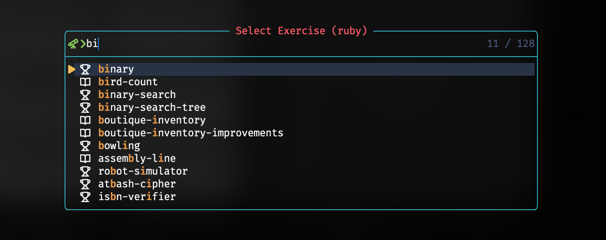

<div align = "center">

<h1><a href="https://github.com/2kabhishek/exercism.nvim">exercism.nvim</a></h1>

<a href="https://github.com/2KAbhishek/exercism.nvim/blob/main/LICENSE">
 </a>

<a href="https://github.com/2KAbhishek/exercism.nvim/graphs/contributors">
 </a>

<a href="https://github.com/2KAbhishek/exercism.nvim/stargazers">
</a>

<a href="https://github.com/2KAbhishek/exercism.nvim/network/members">
 </a>

<a href="https://github.com/2KAbhishek/exercism.nvim/watchers">
 </a>

<a href="https://github.com/2KAbhishek/exercism.nvim/pulse">
 </a>

<h3>Exercism Meets Neovim 💪🧠</h3>

<figure>
  
  <br/>
  <figcaption>exercism.nvim in action</figcaption>
</figure>

</div>

exercism.nvim integrates exercism into Neovim by providing a set of commands and keybindngs to help you solve exercises faster.

## ✨ Features

- Browse and choose exercises from the entire exercism library from within Neovim
- Quickly test and submit your solutions
- Review your existing solution for an exercise
- Simple keybindings and commands to make your workflow faster

## ⚡ Setup

### ⚙️ Requirements

- [utils.nvim](https://github.com/2kabhishek/utils.nvim) for utility functions
- [termin.nvim](https://github.com/2kabhishek/terminal.nvim) for terminal support

- [exercism-cli](https://exercism.io/cli) installed and configured
  - Make sure to login with `exercism configure`
- [tmux-tea](https://github.com/2kabhishek/tmux-tea) (optional, recommended) for separate tmux sessions for each exercise
  - Use `set -g @tea-default-command 'nvim'` for a better experience

### 💻 Installation

```lua
-- Lazy
{
    '2kabhishek/exercism.nvim',
    cmd = {
        'ExercismLanguages',
        'ExercismList',
        'ExercismSubmit',
        'ExercismTest',
    },
    keys = {
        '<leader>exa',
        '<leader>exl',
        '<leader>exs',
        '<leader>ext',
    },
    dependencies = {
        '2kabhishek/utils.nvim', -- required, for utility functions
        '2kabhishek/termim.nvim', -- optional, better UX for running tests
    },
    -- Add your custom configs here, keep it blank for default configs (required)
    opts = {},
},
```

## 🚀 Usage

### Configuration

```lua
exercism.setup({
    exercism_workspace = '~/exercism', -- Default workspace for exercism exercises
    default_language = 'ruby', -- Default language for exercise list
    add_default_keybindings = true, -- Whether to add default keybindings
    icons = {
        concept = '', -- Icon for concept exercises
        practice = '', -- Icon for practice exercises
    },
})
```

### Commands

`exercism.nvim` adds the following commands:

- `ExercismLanguages`: Lists all available languages, select one to list exercises.
- `ExercismList [language]`: Lists exercises for the specified language, if not specified, uses the `default_language`.
- `ExercismTest`: Runs tests for the current exercise.
- `ExercismSubmit`: Submits the current exercise.

### Keybindings

Here are the default keybindings:

- `<leader>exa` for `ExercismLanguages`
- `<leader>exl` for `ExercismList`
- `<leader>ext` for `ExercismTest`
- `<leader>exs` for `ExercismSubmit`

> You can change these by setting `add_default_keybindings` to `false` and adding your own keybindings.

### Help

Run `:help exercism.txt` for more details.

## 🏗️ What's Next

### ✅ To-Do

- [ ] Add tests

## ⛅ Behind The Code

### 🌈 Inspiration

I really like exercism but the back and forth between the browser and the terminal was a bit annoying. So I decided to integrate it with Neovim.

### 💡 Challenges/Learnings

- I build [exercism-fetcher](https://github.com/2kabhishek/exercism-fetcher) to fetch exercises from exercism's github repos.
- Reused knowledge from octohub.nvim, not too many challenges here.

### 🔍 More Info

- [octohub.nvim](https://github.com/2kabhishek/octohub.nvim) — GitHub Repos in Neovim
- [nerdy.nvim](https://github.com/2kabhishek/nerdy.nvim) — Find nerd glyphs easily
- [tdo.nvim](https://github.com/2KAbhishek/tdo.nvim) — Fast and simple notes in Neovim
- [termim.nvim](https://github.com/2kabhishek/termim.nvim) — Neovim terminal improved

<hr>

<div align="center">

<strong>⭐ hit the star button if you found this useful ⭐</strong><br>

<a href="https://github.com/2KAbhishek/exercism.nvim">Source</a>
| <a href="https://2kabhishek.github.io/blog" target="_blank">Blog </a>
| <a href="https://twitter.com/2kabhishek" target="_blank">Twitter </a>
| <a href="https://linkedin.com/in/2kabhishek" target="_blank">LinkedIn </a>
| <a href="https://2kabhishek.github.io/links" target="_blank">More Links </a>
| <a href="https://2kabhishek.github.io/projects" target="_blank">Other Projects </a>

</div>
